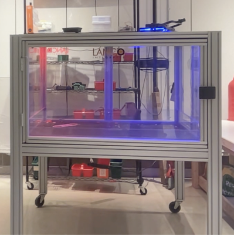
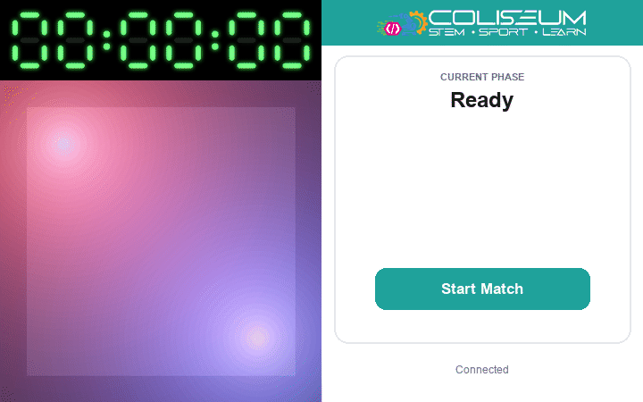
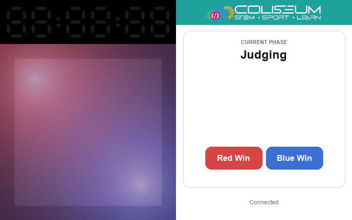
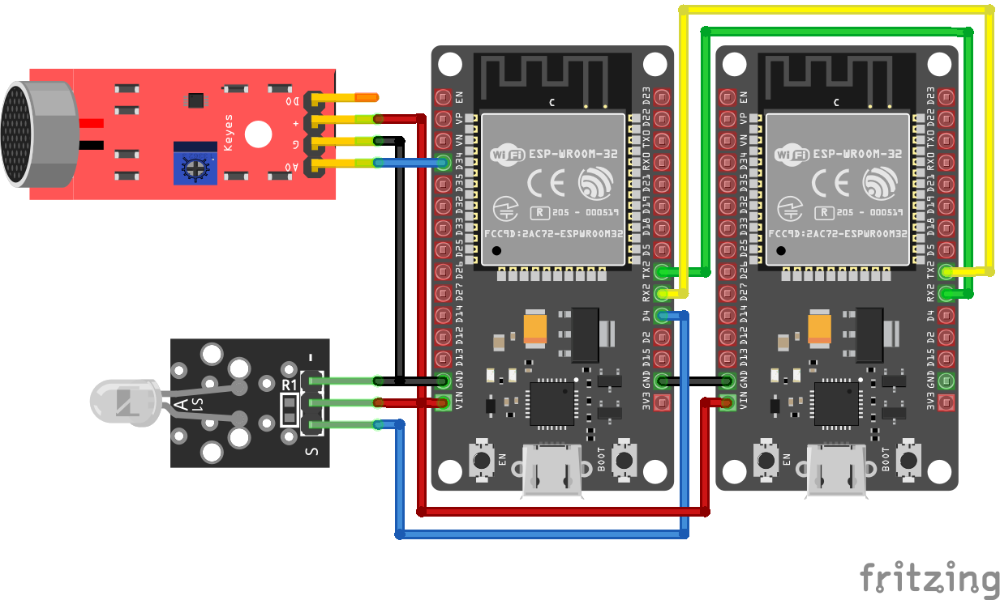

# Coliseum Combat Arena LEDs

 

The [STEM Coliseum](https://stemcoliseum.org) (where I worked full-time over the summer) runs open antweight combat robotics events, and I thought arena LED effects would make the matches more interesting. The hardware for this project was almost entirely what we had laying around the facility, and if I were to make a more general solution, I wouldn't use Wi-Fi-enabled LEDs.

I used AI for this project and was surprised at how well it reverse-engineered the (nonstandard and undocumented) network protocol for the Wi-Fi lights. I used Wireshark to sniff UDP traffic from the proprietary LED control app on my phone to the lights, and described the information I was sending.

I was especially impressed that it was able to determine the parameters in the CRC checksum by writing a Python script to try out common options.

## Features

- [x] Control Wi-Fi-enabled arena LEDs
- [x] Web UI
- [x] Control the timer via infrared
- [x] Microphone support for collision-based effects
- [ ] Enable with a USB button

## Match phases

| Phase | Light State | Timer State | Rendering |
| --- | --- | --- | --- |
| Ready | Red (master) / blue (slave) | powered on, stopwatch |  |
| Countdown | Red/blue, flashing and fading each second | 3·2·1 countdown |  |
| Match | 100% white, flashing on robot impact | running stopwatch (2 min) |  |
| Judging | Red/blue "breathing" alternately | off |  |
| Winner Announcement | Alternating, strobe, then hold winner colour | off |  |
| Arena Cleanup | White, full brightness | off |  |

The board boots straight into the Ready phase; after a match it cycles through Arena Cleanup and back to Ready.

The red corner (master) is on the top left and the blue corner (slave) on the bottom right in every preview. The left side of each preview shows the timer (top) and the arena (bottom); the right side shows the mobile web UI for that phase.

The Match lights sit at 100% white and strobe on impact instead of the original red/blue flash; each impact flash lasts a slightly different length.

## Architecture

The program goes through multiple match phases, each with distinct light animations:

Here's a diagram of the wiring. The left ESP32 is the master, connected to the microphone, IR transmitter, and (over Wi-Fi) one of the LEDs. The right ESP32 is the slave: connected to the other LED on its separate Wi-Fi network, and receives commands from the master over a serial port.

## Hardware

- 2× ESP32 dev board — one master, one slave
- 2× Wi-Fi-enabled LED light (they listen on UDP port 2525)
- Microphone/sound module with analog output (AO) → master GPIO34
- IR transmitter module (e.g. KY-005) → master GPIO4
- Fitness timer with IR remote
- Jumper wires, breadboard, USB power

The master's UART2 connects to the slave's: master TX (GPIO17) → slave RX (GPIO16), master RX (GPIO16) ← slave TX (GPIO17), with a common GND. See the wiring diagram above.

## Getting it running

1. Flash `led_master_esp32/` to the master board and `led_slave_esp32/` to the slave.
2. The master sketch needs ArduinoJson, AsyncTCP, ESPAsyncWebServer (ESP32Async), and IRremote — exact versions are listed at the top of the master `.ino`. The slave only uses the core ESP32 WiFi/UDP libraries.
3. Power both boards. Each joins its own light's network (`COMBAT_LED` / `COMBAT_LED2`) and the web UI comes up at `http://arena.local`.

## How to use it?

1. Connect to the `COMBAT_LED` network on your phone (password `gvm_admin`).
2. Load the web UI.
    > [!TIP]
    > If it's not loading, try disabling your mobile data. Your phone might have realised the `COMBAT_LED` network doesn't have access to WAN, and might be trying to resolve the IP through mobile data.
3. Continue through the phases of the match. When you finish one match, it cycles back and is ready for another.

## How to modify it?

- **Match timings** — `COUNTDOWN_MS` and `MATCH_MS` in `led_master_esp32/led_master_esp32.ino`.
- **Phases and transitions** — the `Phase` enum, `applyAction()`, and the `tickCountdown()`/`tickMatch()` functions define the state machine. The buttons shown for each phase come from `buttonDefs()` in `led_master_esp32/arena_ui.h`.
- **Per-phase lighting** — `updateLightingForPhase()` sets the look when a phase starts; `processLightingAnimations()` drives the animated effects (countdown flash, judging "breathing", announcement strobe). Collision flashes during the match are handled by `processMicBrightness()`, tuned by the constants in the `mic` namespace (e.g. `HIT_THRESHOLD`, `FLASH_HOLD_MS`).
- **IR timer control** — the `display` namespace maps the fitness timer's remote buttons (`BTN_*` constants) and decides when they're pressed in `onPhaseEntered()` and `onCountdownTick()`.
- **Web UI** — all the HTML/CSS/JS is a single header, `led_master_esp32/arena_ui.h`.
- **Networks** — the master joins its own light's network (`COMBAT_LED`) at the top of `led_master_esp32/led_master_esp32.ino`; the slave joins a second light's network (`COMBAT_LED2`) at the top of `led_slave_esp32/led_slave_esp32.ino`.
- **Adding another light** — the master talks to the slave over a simple framed serial protocol (the `wirelink` namespace), and each slave relays `(selector, value)` frames to its own light, so another slave board is all you'd need to drive a third light.
- **Dependencies** — the required libraries are listed at the top of `led_master_esp32/led_master_esp32.ino`.
