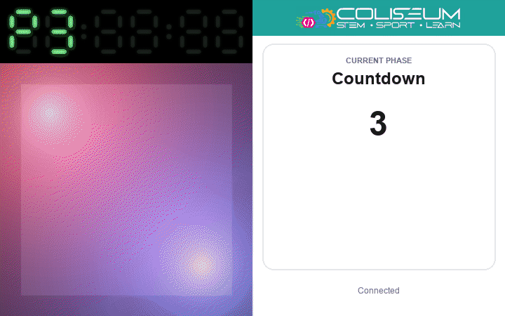
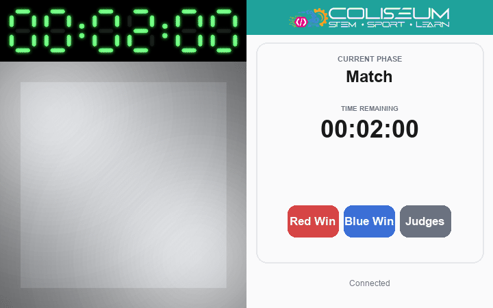
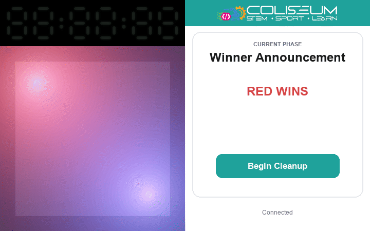
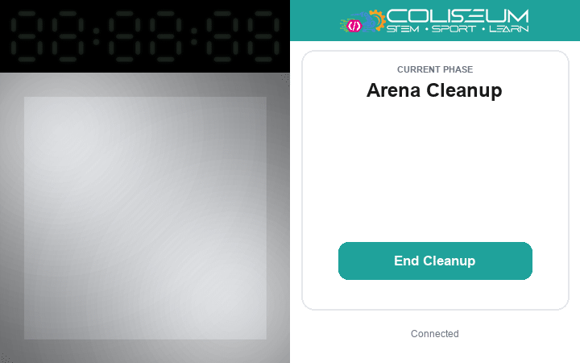
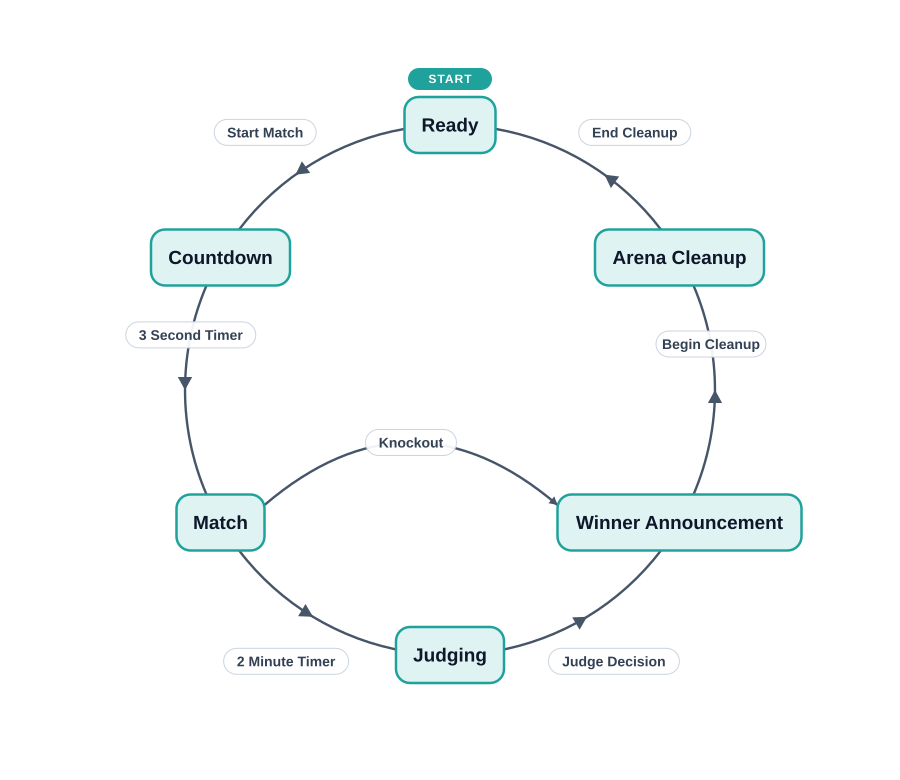

# Combat Robotics Arena Lighting


The [STEM Coliseum](https://stemcoliseum.org) — where I worked full-time over the summer — runs open antweight combat robotics events, and I thought arena LED effects would make the matches more interesting. The hardware was almost entirely whatever we had lying around the facility, so the choices are unconventional.

I tried to use AI to streamline the development of this project and was surprised that without much help it was able to reverse-engineer the (nonstandard and undocumented) network protocol for the Wi-Fi lights. I used Wireshark to sniff UDP traffic from the proprietary LED control app on my phone to the lights, and described the information I was sending. The AI even automatically determined the parameters in the CRC checksum by writing a Python script to try out common options — very cool!

## Features

- [x] Wi-Fi control of the arena lights
- [x] Web UI
- [x] Infrared control of the match timer
- [x] Impact-reactive lighting effects
- [ ] USB button to advance to the next phase

## Match phases

| Phase | Light & Timer State | Rendering |
| --- | --- | --- |
| Ready | Red (master) / blue (slave); timer powered on, stopwatch |  |
| Countdown | Red/blue, flashing and fading each second; 3·2·1 countdown |  |
| Match | 100% white, flashing on robot impact; running stopwatch (2 min) |  |
| Judging | Red/blue "breathing" alternately; timer off |  |
| Winner Announcement | Alternating, strobe, then hold winner colour; timer off |  |
| Arena Cleanup | White, full brightness; timer off |  |

The board boots straight into the Ready phase; after a match it cycles through Arena Cleanup and back to Ready.



## Hardware

- 2× ESP32 dev board — one master, one slave
- 2× Wi-Fi-enabled LED lights (they listen on UDP port 2525)
- Microphone/sound module with analog output (AO) → master GPIO34
- IR transmitter module (e.g. KY-005) → master GPIO4
- Match timer with IR remote
- Jumper wires, breadboard, USB power

The left ESP32 is the master, connected to the microphone, IR transmitter, and (over Wi-Fi) one of the LEDs. The right ESP32 is the slave, connected to the other LED on its separate Wi-Fi network, and receives commands from the master over a serial port.


The master's UART2 connects to the slave's: master TX (GPIO17) → slave RX (GPIO16), master RX (GPIO16) ← slave TX (GPIO17), with a common GND.

## Setup

### Build & flash (no Arduino IDE needed)

You only need Python 3.10+. The first run downloads PlatformIO, the ESP32
toolchain, and the sketch libraries automatically (the master uses ArduinoJson,
AsyncTCP, ESPAsyncWebServer, and IRremote — exact versions are pinned in
`led_master_esp32/platformio.ini`):

```sh
python3 flash.py master          # build + flash the master board
python3 flash.py slave           # build + flash the slave board
python3 flash.py slave --build-only   # compile only, no flashing
python3 flash.py master --monitor     # flash, then open the serial monitor
```

If the board isn't auto-detected, pass its USB port:

```sh
python3 flash.py master --port /dev/tty.usbserial-0001   # macOS / Linux
python3 flash.py slave --port COM3                        # Windows
```

Plug each board into your computer over USB while flashing. Press the board's
`EN`/`RST` button if it doesn't auto-restart afterward.

> `flash.py` works on macOS, Linux, and Windows. Each sketch folder is also a
> self-contained PlatformIO project, so with PlatformIO installed you can run
> `pio run -d led_master_esp32 -t upload` (or `led_slave_esp32`) directly.

### First run

1. Flash the sketch in `led_master_esp32/` to the master board and the one in `led_slave_esp32/` to the slave.
2. Power both boards. Each joins its own light's network (`COMBAT_LED` / `COMBAT_LED2`).
3. Connect to the `COMBAT_LED` network on your phone (password `gvm_admin`).
4. Load the web UI at `http://192.168.4.2`.
> [!TIP]
> If it's not loading, try disabling your mobile data. Your phone might have realised the `COMBAT_LED` network doesn't have access to WAN, and might be trying to resolve the IP through mobile data.
5. Continue through the phases of the match. When you finish one match, it cycles back and is ready for another.

## Customizing

- **Match timings** — `COUNTDOWN_MS` and `MATCH_MS` in `led_master_esp32/led_master_esp32.ino`.
- **Phases and transitions** — the `Phase` enum, `applyAction()`, and the `tickCountdown()`/`tickMatch()` functions define the state machine. The action strings returned by `buttonDefs()` in `led_master_esp32/arena_ui.h` (e.g. `startMatch`, `redWin`, `judges`) must match the cases handled by `applyAction()`.
- **Per-phase lighting** — `updateLightingForPhase()` sets the look when a phase starts; colours, hues, and brightness defaults are hardcoded there (e.g. red = 0°, blue = 240°). `processLightingAnimations()` drives the animated effects (countdown flash, judging "breathing", announcement strobe). Impact flashes during the match are handled by `processMicBrightness()`, tuned by the constants in the `mic` namespace (e.g. `HIT_THRESHOLD`, `FLASH_HOLD_MS`).
- **IR timer control** — the `display` namespace maps the match timer's remote buttons (`BTN_*` constants) and decides when they're pressed in `onPhaseEntered()` and `onCountdownTick()`.
- **Web UI** — all the HTML/CSS/JS is a single header, `led_master_esp32/arena_ui.h`.
- **Networks / Wi-Fi credentials** — the SSID, password, static IP, gateway, subnet, DNS, and bulb broadcast address are all at the top of `led_master_esp32/led_master_esp32.ino` (master) and `led_slave_esp32/led_slave_esp32.ino` (slave).
- **Wired link and adding another light** — the master talks to the slave over UART2 (GPIO16/17 by default) using the framed serial protocol in the `wirelink` namespace; the slave forwards `(selector, value)` frames to its own light. Another slave board is all you'd need to drive a third light; update `linkRxPin`/`linkTxPin`/`linkBaud` in both sketches if you change the wiring.
